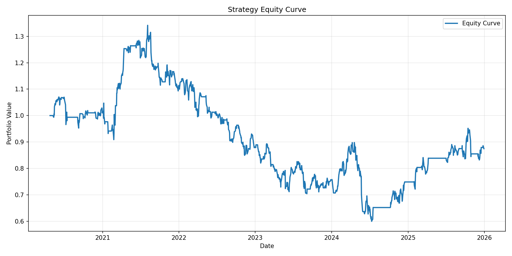
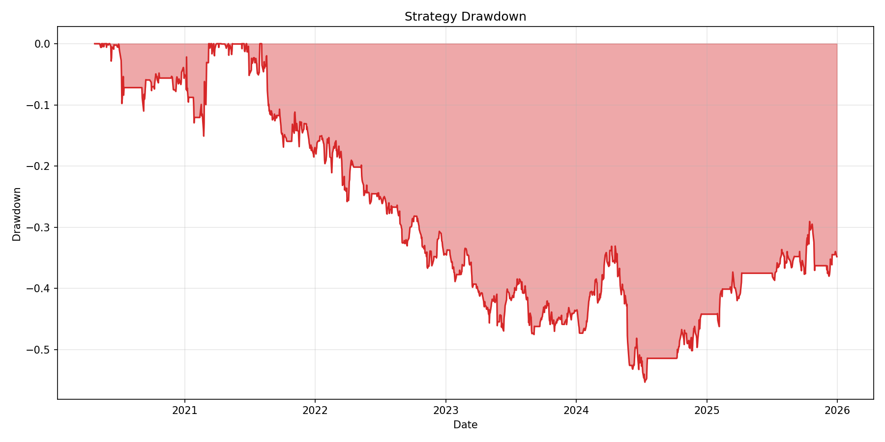
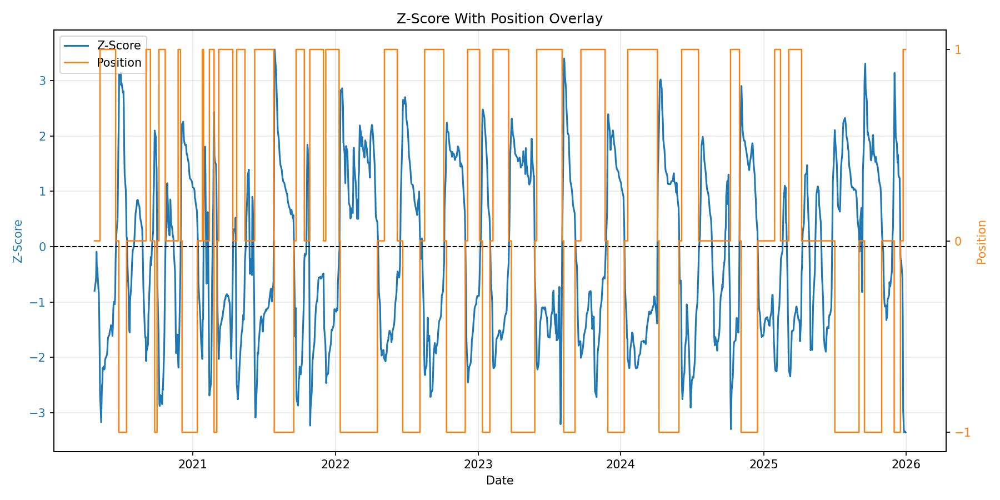

# Quantitative Signal Research & Backtesting Pipeline

A recruiter-focused project demonstrating an end-to-end workflow for **statistical signal design, financial time series analysis, and backtesting** using Python and SQL.

## 🧠 Motivation

I built this project to better understand how quantitative investment firms transform raw market data into statistically grounded signals.

The focus was not on finding alpha, but on building a clean, reproducible pipeline that reflects real-world workflows:
data → hypothesis → signal → backtest → evaluation → monitoring.
---

## 🔍 Overview

This project builds a **market-neutral mean-reversion strategy** using historical equity price data.

It simulates a real-world quant research workflow:

- Data ingestion and cleaning  
- Feature engineering (spread, rolling statistics)  
- Statistical signal construction (z-score normalization)  
- Hypothesis-driven strategy design  
- Backtesting with transaction costs  
- Performance evaluation (Sharpe, drawdown, hit rate)  
- Visualization and diagnostics  

---

## 📈 Example Outputs

### Equity Curve

Interpretation:
The equity curve shows the cumulative performance of the strategy over time.
	•	Periods of steady upward movement indicate that the mean-reversion signal is capturing short-term dislocations effectively
	•	Flat or declining regions suggest either weak signal strength or regimes where the spread does not revert as expected
	•	Sudden changes in slope can indicate shifts in market behavior or breakdowns in the underlying relationship between assets
Takeaway:
The strategy demonstrates how a simple statistical signal can generate structured returns, but also highlights the importance of regime awareness and robustness testing.

### Drawdown

Interpretation:
The drawdown chart highlights the magnitude and duration of losses from peak portfolio value.
	•	Large drawdowns indicate periods where the signal fails or the spread trends instead of reverting
	•	Extended drawdown duration can signal structural changes in the relationship between assets
	•	Frequent small drawdowns are expected in mean-reversion strategies due to noise
Takeaway:
Drawdowns emphasize the risk profile of the strategy and the importance of risk management, position sizing, and validation across different market conditions.

### Signal Diagnostics (Z-score & Position)

This chart overlays the statistical signal (z-score) with the resulting trading position.
	•	Entry points align with extreme z-score values (beyond thresholds), reflecting statistically significant deviations
	•	Exits occur as the z-score reverts toward zero, consistent with mean-reversion logic
	•	The position series helps validate that the strategy is behaving as intended without excessive overtrading
Takeaway:
This visualization confirms that the signal logic is consistent with the underlying statistical hypothesis and provides transparency into how decisions are made.

!! Future work would include out-of-sample validation and robustness checks to assess whether observed performance generalizes beyond the training period.
---

## 🧠 Methodology

### 1. Spread Construction
We construct a simple spread between two correlated assets:
spread = price_A - price_B

### 2. Statistical Normalization
We compute a rolling z-score: 
z = (spread - rolling_mean) / rolling_std

### 3. Trading Logic (Mean Reversion)

- Long spread when z < -threshold  
- Short spread when z > +threshold  
- Exit when z reverts toward 0  

### 4. Backtesting

- Positions are **lagged** to avoid lookahead bias  
- Transaction costs are included  
- Returns are compounded into an equity curve  

---

## 📊 Performance Metrics

- Total Return  
- Annualized Return  
- Sharpe Ratio  
- Maximum Drawdown  
- Hit Rate  

---

## 🧪 Key Findings

- Demonstrates a full research pipeline from raw data to performance evaluation  
- Highlights how rolling statistics can be used to construct interpretable signals  
- Shows importance of transaction costs and position timing  
- Provides a framework for extending into more advanced quant strategies  

---

## ⚠️ Disclaimer

This is a **research demonstration project**, not a production trading system.  
It does not claim to produce profitable or deployable strategies.

---

## ⚙️ Setup

```bash
python3 -m venv .venv
source .venv/bin/activate
pip install -r requirements.txt
